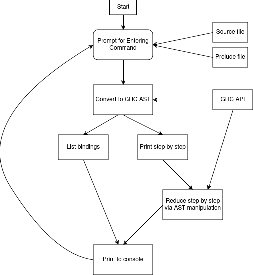

# A Tool for Visualizing Reductions in Haskell

## Quick Start
In the project root directory first build the project using 
```shell
stack build
```
<p>

To start the tool run the following command
```shell
stack exec vTool
```
This starts a basic interactive console where you can enter commands of your choice

Run `--help` to see available options
```plain
Enter command: --help
A Tool for Visualizing Reductions in Haskell

Usage: vTool (step | list)

Available options:
  -h,--help                Show this help text

Available commands:
  step                     
  list
```

All available commands can be run with `--help` to get more info on how to use them.

### Reductions
Get step by step reductions for the Haskell Core version of an user program
```shell
Enter command: step --help
Usage: vTool step (-p|--path STRING) [-f|--function STRING] [-v|--verbose]

Available options:
  -h,--help                Show this help text
  -p,--path STRING         The Haskell source file used as input to the tool
  -f,--function STRING     Top level function to step through
  -v,--verbose             Enable verbose output if set
```
Note that you have to copy and place [This mini-custom Prelude file](./src/MiniPrelude.hs) in the same directory as your test program. 

Follow the template below for your test programs
```haskell
{-# OPTIONS -XNoImplicitPrelude #-}

module THE_FILE_NAME where

import MiniPrelude -- Not required

-- Your code below
```

### Listing
List all top level bindings in the Haskell Core version of an user program
```shell
Enter command: list --help
Usage: vTool list (-p|--path STRING)

Available options:
  -h,--help                Show this help text
  -p,--path STRING         The Haskell source file used as input to the tool
```

## Methodology

This [flowchart](#fig:flowchart) provides an overview of the working of our reduction visualizer tool.



### Types of Reductions Covered in the Tool
The subset of reductions being covered includes:

1. **Replace with binding**
   - Replace a variable with the expression it's bound to (its definition)
   - In Haskell, each variable can be defined only once

2. **Lambda application**
   - Application of a single argument to an Anonymous function
   - Example: `(\lambda x -> 2*x) 1`

3. **Evaluating unsteppable function** (e.g., +, *, /= etc.)
   - Reductions can be performed over defined rules. Numeric computations are not expressed as reductions of expressions; they need to be evaluated explicitly
   - A `(2 + 3)` expression is computed as 5 by the tool

4. **Reduce case expression**
   - Case expressions are used internally when typical Haskell functions are defined as a set of rules from top to bottom
   - The expression passed to the case statement may not be in normal form, in the previous reduction rule we have seen that we need to totally reduce expressions before comparison (strict behaviour)

5. **Replace with matching pattern**
   - Replace the current case application expression with the expression corresponding to the matched pattern

6. **Reduce function in an application** (for `expr arg` expr needs to be reduced to a fun)
   - Replace a function with the definition it's binded to

7. **Strictly evaluate application arguments**
   - When evaluating unsteppable functions strict behaviour needs to be enforced and the args need to be evaluated

8. **Nested reduction**
   - An expression could be of the form `(\lambda x -> 2*x) (2 + 3)`, the expression `2+3` needs to be evaluated and then given to the anonymous function

The reductions are performed until no more reductions can be performed, and the program prints all the steps. If the number of steps exceeds a threshold of 200, we preemptively assume that there's an infinite chain of reductions and abort the reduction process for that particular expression.

## Examples

### Support for pattern matching (Case statements)
```haskell
myFun :: Integer -> String
myFun 1 = "One!"
myFun 2 = "Two!"
myFun 3 = "Three!"
myFun x = "Not between 1 and 3"

patternMatchingExample = myFun 4
```

```
Enter command: step --path Rough/Examples.hs --function patternMatchingExample

**** Reduction of patternMatchingExample ****
myFun 4

---- Replace with matching pattern
case 4 == 2 of {
  False ->
    case 4 == 3 of {
      False -> "Not between 1 and 3";
      True -> "Three!"
    };
  True -> "Two!"
}

---- Replace with matching pattern
case 4 == 3 of {
  False -> "Not between 1 and 3";
  True -> "Three!"
}

---- Replace with matching pattern
"Not between 1 and 3"

---- Evaluate unsteppable function/operator unpackCString#
"Not between 1 and 3"

---- All reductions completed
```

### Support for irreducible computations
```haskell
irreducableExpressionEvaln = 1 + (2 * 3)
```

```
Enter command: step --path Rough/Examples.hs --function irreducableExpressionEvaln

**** Reduction of irreducableExpressionEvaln ****
1 + (2 * 3)

---- Evaluate unsteppable function/operator +
7

---- All reductions completed
```

### Support for anonymous functions
```haskell
anonFn = (\x -> x + x)

lamdaApplicationExample = anonFn 1
```

```
Enter command: step --path Rough/Examples.hs --function lamdaApplicationExample --verbose

**** Reduction of lamdaApplicationExample ****
anonFn 1

---- Reduce function of application -> Replace 'anonFn' with definition
(\x -> x + x) 1

---- Lamda Application
1 + 1

---- Evaluate unsteppable function/operator +
2

---- All reductions completed
```

### Support for String type
```haskell
getString :: Bool -> String
getString True = "Yes, its True"
getString False = "No its false"

aString = getString True
```

```
Enter command: step --path Rough/Examples.hs --function aString

**** Reduction of aString ****
getString True

---- Replace with matching pattern
"Yes, its True"

---- Evaluate unsteppable function/operator unpackCString#
"Yes, its True"

---- All reductions completed
```

### Support for standard function defns
```haskell
double :: Num a => a -> a
double x = x + x

a = double 1
```

```
Enter command: step --path Rough/Examples.hs --function a

**** Reduction of a ****
double 1

---- Evaluate unsteppable function/operator +
2

---- All reductions completed
```

#### For more than 1 argument
```haskell
f :: Bool -> Bool -> Bool
f x y = not x && y

result = f True False
```

Can use --verbose option to see the steps in more detail
```
Enter command: step --path Rough/Examples.hs --function result

**** Reduction of result ****
f True False

---- Replace with matching pattern
False

---- All reductions completed
```

#### For recursive calls
This example has partial support only because type constructors are not handled
```haskell
addRepeat:: Int -> Int -> Int -> Int
addRepeat a 0 sum_rn = sum_rn
addRepeat a n sum_rn = addRepeat a (n - 1) (sum_rn + a)

rst = addRepeat 2 2 0
```

```
Enter command: step --path Rough/Examples.hs --function rst  

**** Reduction of rst ****
addRepeat 2 2 0

---- Replace with matching pattern
case 2 of {
  0 -> 0;
  _ -> (addRepeat 2 (2 - 1) (0 + 2))
}

---- Replace with matching pattern
addRepeat 2 (2 - 1) (0 + 2)

---- Reduce Case Expression -> Evaluate unsteppable function/operator -
case 1 of {
  I# ds_dL7U ->
    case ds_dL7U of {
      0 -> (0 + 2);
      _ -> (addRepeat 2 ((2 - 1) - 1) ((0 + 2) + 2))
    }
}

---- Reduction chain completed: No reduction rule implemented for this expression
```

### Support for list operations
```haskell
reverseList :: [Integer] -> [Integer]
reverseList [] = []
reverseList (a:bc) = reverseList bc ++ [a]

rList = reverseList [1, 2, 3]
```

```
Enter command: step --path Rough/Examples.hs --function rList        

**** Reduction of rList ****
reverseList [1, 2, 3]

---- Replace with matching pattern
(reverseList [2, 3]) ++ [1]

---- Replace with matching pattern
3 : (([] ++ [2]) ++ [1])

---- Reduction complete - reduce constructor arguments for better visualization
[3, 2, 1]

---- All reductions completed
```

### Support for Float type
This example is only partially supported because let statements are not supported yet
```haskell
x = 1.0 + 2.0

fltResult = maximum [1.0, 2.0, 3.0]
```

```
Enter command: step --path Rough/Examples.hs --function x

**** Reduction of x ****
1 % 1 + 2 % 1

---- Evaluate unsteppable function/operator +
3 % 1

---- All reductions completed
----------------------------------------------------------------------------------------------
Enter command: step --path Rough/Examples.hs --function fltResult

**** Reduction of fltResult ****
maximum [1 % 1, 2 % 1, 3 % 1]

---- Lamda Application
Let is not supported [1 % 1, 2 % 1, 3 % 1]

---- Reduction chain completed: No reduction rule implemented for this expression
```

### Nested function application
```haskell
y = anonFn (double 1)
```

```
Enter command: step --path Rough/Examples.hs --function y

**** Reduction of y ****
anonFn (double 1)

---- Evaluate unsteppable function/operator +
4

---- All reductions completed
```